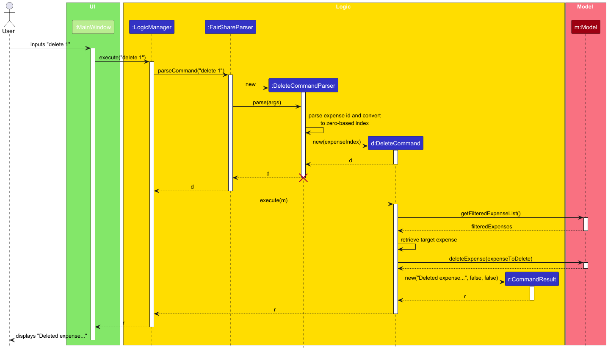

# FairShare Developer Guide

--------------------------------------------------------------------------------------------------------------------

## Table of Contents
- [Setup](#setup)
- [Architecture Overview](#architecture-overview)
- [Component Breakdown](#component-breakdown)
    - [UI](#ui)
    - [Logic](#logic)
    - [Model](#model)
    - [Storage](#storage)
- [Key Implementation Details](#key-implementation-details)
    - [Command Flow](#command-flow)
    - [Splits, Filters, and Validation](#splits-filters-and-validation)
    - [Balance Calculation](#balance-calculation)
    - [Settlements as Expenses](#settlements-as-expenses)
    - [Corrupted File Handling](#corrupted-file-handling)
- [Extending FairShare](#extending-fairshare)
- [Testing](#testing)
- [Appendix: Instructions for Manual Testing](#appendix-instructions-for-manual-testing)

--------------------------------------------------------------------------------------------------------------------

## Setup
Prerequisites: JDK 21.

The following setup guide is for IntelliJ IDEA, our recommended IDE. You are welcome to use other IDEs but please note that you will need to configure your workspace manually.

1. Fork the repository and clone the fork to your local machine.
2. Open the project in IntelliJ:
    1. Click `Open`.
    2. Select the project directory and click `OK`.
    3. If prompted, accept the default import settings.
3. Configure the project to use **JDK 21** as described [here](https://www.jetbrains.com/help/idea/sdk.html#set-up-jdk).  
   In the same dialog, set the **Project language level** to `SDK default`.
4. Verify the setup:
    1. Run `src/main/java/fairshare/Launcher.java`.
    2. Run the unit tests from the terminal using `./gradlew clean test`.

--------------------------------------------------------------------------------------------------------------------

## Architecture Overview

The following diagram shows a high-level design of the application.


### Core Components
The `Main` component consists of [Launcher](https://github.com/nus-cs2103de-ay2526s2-grp6/tp/blob/master/src/main/java/fairshare/Launcher.java) and [FairShare](https://github.com/nus-cs2103de-ay2526s2-grp6/tp/blob/master/src/main/java/fairshare/FairShare.java). These classes are responsible for starting up and shutting down the application.
- At startup, `Launcher` launches `FairShare` which then initializes the other components of the app.
- At shutdown, `FairShare` saves the application state before exiting.

Once started (after boot), the application is mostly handled by the other four components:
- [UI](https://github.com/nus-cs2103de-ay2526s2-grp6/tp/blob/master/src/main/java/fairshare/ui/Ui.java): user interface of the app.
- [Logic](https://github.com/nus-cs2103de-ay2526s2-grp6/tp/blob/master/src/main/java/fairshare/logic/Logic.java): parses and executes commands
- [Model](https://github.com/nus-cs2103de-ay2526s2-grp6/tp/blob/master/src/main/java/fairshare/model/Model.java): stores and manages the app data
- [Storage](https://github.com/nus-cs2103de-ay2526s2-grp6/tp/blob/master/src/main/java/fairshare/storage/Storage.java): reads and writes application data to the hard disk.

--------------------------------------------------------------------------------------------------------------------

## Component Breakdown

### UI


The UI is built using JavaFX. Each component loads its own `.fxml` file from `src/main/resources/view`.

`MainWindow` is the main UI class. It owns and wires the following components:
- `Header`
- `ExpenseListPanel`
- `BalancePanel`
- `PieChart`
- `StatusBar`
- `ResultDisplay`
- `CommandBox`
- `HelpWindow`
- `InsightsWindow`

Note: Help and insights are separate popup stages and not embedded panes.

### Logic


`LogicManager` abstracts the complexities of command parsing and execution, providing the UI with a clean API.

Responsibilities:
- parse raw user input into a `Command`
- execute the command using `Model`
- save the updated state through `Storage`
- expose read APIs for `Ui` to read and display expense data

Implemented commands:
- `add`
- `delete`
- `update`
- `filter`
- `list`
- `settle`
- `clear`
- `help`
- `exit`

### Model


`ModelManager` owns two views of the same underlying data:
- `ExpenseList` for the full mutable list
- `FilteredList<Expense>` for the current visible list

Core classes:
- `Expense`: group, name, amount, payer, participants, tags, type
- `Participant`: a `Person` plus share count
- `Balance`: debtor, creditor, amount
- `Group`, `Person`, `Tag`
- `ExpenseType`: `EXPENSE` or `SETTLEMENT`

Data standardization:
- `Group` names are uppercased
- `Tag` names are lowercased
- `Person` equality is determined by a case-insensitive name match (e.g., John is equal to john)
- `Participant` equality is determined only by the `Person`, not on shares

### Storage


FairShare stores data in a simple text file format.

Core classes:
- `StorageManager`: main controller for storage
- `TxtFairShareStorage`: handles file I/O
- `TxtSerializableFairShare`: serializes/deserializes the full expense list
- `TxtAdaptedExpense`, `TxtAdaptedGroup`, `TxtAdaptedPerson`, `TxtAdaptedParticipant`, `TxtAdaptedTag`: text-friendly adapters

Storage format:
```text
group|expenseName|amount|payer|participant1:shares,participant2:shares|tag1,tag2|expenseType
```

Example:
```text
MALAYSIA|Lunch|20.0|alice|alice:3,bob:1|food|EXPENSE
MALAYSIA|Settlement|10.0|alice|bob:1||SETTLEMENT
```

--------------------------------------------------------------------------------------------------------------------

## Key Implementation Details

### Command Flow

The following sequence diagram illustrates the typical command flow, using `delete` as an example.



### Splits, Filters, and Validation

#### Expense Splits
Two split modes are supported:
- equal split: `s/alice s/bob s/carol`
- proportional split: `s/alice:2 s/bob:1`

Rules enforced by `ParserUtil.parseParticipants(...)`:
- amount must be `> 0`
- shares must be positive integers
- duplicate participant names are rejected
- mixed equal/proportional syntax in the same command is rejected

#### Filter Logic
`filter` combines fields with logical AND.

Within a single field:
- `g/`, `n/`, `p/`, `s/` uses logic OR
- `t/` uses logical AND, i.e. all specified tags must be present

Examples:
- `filter g/JB g/JAPAN` -> group is JB **or** JAPAN
- `filter g/JB t/food t/travel` -> group is JB **and** both tags exist

`filter` requires at least one prefix. Use `list` to clear the filter.

### Balance Calculation

#### Stage 1: compute net amounts per person
For each expense in a group:
- add the full amount to the payer
- subtract each participant's proportional share

#### Stage 2: simplify debts
- people below `-0.01` become debtors
- people above `0.01` become creditors
- a greedy matcher creates `Balance` objects until both sides are settled

### Settlements as Expenses

A settlement is not a separate model type. It is implemented as:
- `ExpenseType.SETTLEMENT`
- fixed expense name `"Settlement"`
- the receiver stored as a single participant
- no tags

### Corrupted File Handling

When loading saved data at startup, FairShare handles three possible cases:
- if the file is missing, an empty list is returned
- if the file is valid, the stored expenses are deserialized and loaded
- if the file cannot be read or is corrupted, the file is deleted and `StorageException` is thrown

When this happens, `FairShare.init()` catches the exception, starts the app with an empty model, and displays a warning in the result display.

--------------------------------------------------------------------------------------------------------------------

## Extending FairShare

This section provides guidance on common feature extensions in FairShare. The list is not exhaustive.

### Adding a new command
1. Create a new `XCommand` in `logic/commands`.
2. Create `XCommandParser` if the command has arguments.
3. Register the command in `FairShareParser`.
4. Add or reuse the required `Model` API.
5. Update any UI panels that should refresh after the command runs.
6. Add unit tests for parser, command, and overall logic flow.

### Adding a new field to `Expense`
1. Add the field to the `Expense` class.
2. Update `TxtAdaptedExpense` and any related adapter classes.
3. Update serialization and deserialization logic.
4. Update parsers, commands, and UI cards that use or display the new field.
5. Add storage tests to ensure the new field is saved and loaded correctly.

--------------------------------------------------------------------------------------------------------------------

## Testing

FairShare is tested through both automated and manual testing.

Automated tests are located mainly in:
```text
src/test/java/fairshare
```
They can be run from the terminal using the Gradle wrapper: `./gradlew clean test`.

These tests cover command execution, parser behaviour, storage saving and loading, and corrupted file handling.

Detailed step-by-step manual test cases are provided in the appendix below.

--------------------------------------------------------------------------------------------------------------------

## Appendix: Instructions for Manual Testing

> **Note:** The following list of manual test cases is not comprehensive. It is intended to provide a starting point for exploratory testing.

### Adding an Expense

**1. Adding a normal expense with an equal split**
- **Test case:** `add n/Lunch a/20 g/JB p/Alice s/Alice s/Bob`
- **Expected:**
    - A new expense named "Lunch" is added.
    - The expense appears in the expense list.
    - A success message is shown in the result display.
    - Related UI panels such as balances, charts, and status information are updated.

**2. Adding a normal expense with a proportional split**
- **Test case:** `add n/Dinner a/30 g/JB p/Alice s/Alice:2 s/Bob:1`
- **Expected:**
    - A new expense named "Dinner" is added.
    - The split is stored according to the given shares.
    - A success message is shown in the result display.

**3. Adding an expense with duplicate participants**
- **Test case:** `add n/Lunch a/20 g/JB p/Alice s/Alice s/Alice`
- **Expected:**
    * No expense is added.
    * An error message is shown indicating that duplicate participant names are not allowed.

**4. Adding an expense with mixed split syntax**
- **Test case:** `add n/Lunch a/20 g/JB p/Alice s/Alice s/Bob:2`
- **Expected:**
    - No expense is added.
    - An error message is shown indicating that equal and proportional split syntax cannot be mixed.


### Deleting an Expense

**1. Deleting an expense while all expenses are shown**
- **Prerequisites:**
    - Use the `list` command so that all expenses are shown.
    - There are multiple expenses in the list.
- **Test case:** `delete 1`
- **Expected:**
    - The first displayed expense is deleted.
    - A success message is shown in the result display.
    - The expense list and related UI panels are updated.

**2. Deleting with an invalid index**
- **Test case:** `delete 0`
- **Expected:**
    - No expense is deleted.
    - An error message is shown.


### Updating an Expense

**1. Updating a displayed expense**
- **Prerequisites:** There is at least one displayed expense.
- **Test case:** `update 1 n/Brunch a/25`
- **Expected:**
    - The first displayed expense is updated.
    - The updated values (name changed to "Brunch", amount changed to 25) are reflected in the expense list.
    - A success message is shown in the result display.

**2. Updating with an invalid index**
- **Test case:** `update 0 n/Brunch`
- **Expected:**
    - No expense is updated.
    - An error message is shown.

### Filtering Expenses

**1. Filtering by group**
- **Prerequisites:** There are expenses from multiple groups in the current data.
- **Test case:** `filter g/JB`
- **Expected:**
    - Only expenses belonging to the group "JB" are shown.
    - The balance panel, pie chart, and status bar update to reflect only the filtered list.

**2. Filtering by multiple groups**
- **Test case:** `filter g/JB g/JAPAN`
- **Expected:**
    - Expenses belonging to *either* "JB" or "JAPAN" are shown.

**3. Filtering by tags**
- **Test case:** `filter t/food t/travel`
- **Expected:**
    - Only expenses containing *both* "food" and "travel" tags are shown.
