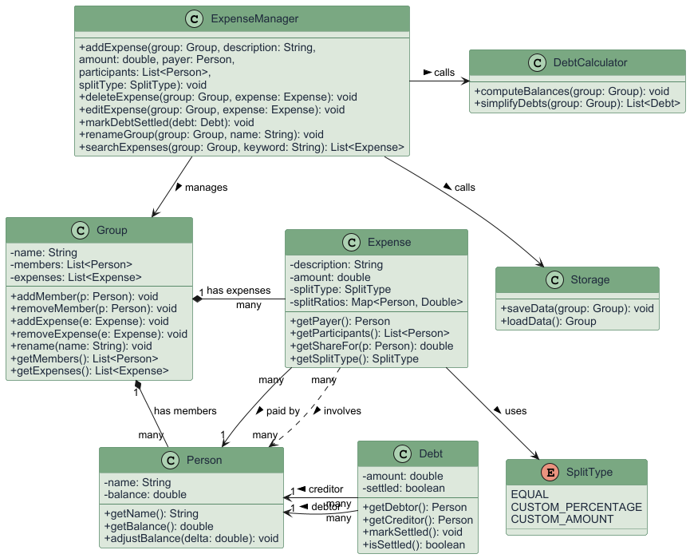
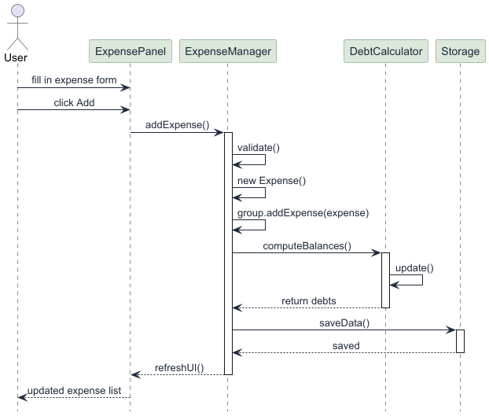

### Software Design Documentation (SDD)

## Table of Contents
- [1. System Overview](#1-system-overview)
- [2. Architecture Design](#2-architecture-design)
  - [2.1 Architectural Pattern](#architectural-pattern)
- [3. Major System Components](#3-major-system-components)
  - [Model Layer](#model-layer)
  - [Logic Layer](#logic-layer)
  - [UI Layer](#ui-layer)
  - [Storage layer](#storage-layer)
- [4. UML Diagrams](#4-uml-diagrams)
  - [4.1 Class Diagrams](#class-diagram)
  - [4.2 Sequence Diagrams](#sequence-diagram---add-expenses)
  - [4.3 Use Case Diagrams](#use-case-diagram)
- [5. Key Design Decisions](#5-key-design-decisions)
  - [5.1 Layered Architecture]( #layered-architecture)

## 1. System Overview
The Shared Expense Tracker is an application that enables groups of users to record, manage and settle shared expenses.
It targets friend groups, housemates and small teams who need to split costs without manual calculation.
**The system allows users to:**
- Create and manage expense groups with named members
- Record expenses with a payer, amount, description and list of involved participants
- View a simplified debt summary for the user, showing how much they owe and are owed
- Mark debts as settled and reload all data locally between sessions 

## 2. Architecture Design
# Architectural Pattern

Each layer communicates only with adjacent layers. The UI layer never directly addresses storage and the storage layer has no knowledge of the UI. 
This separation makes the system easier to test and maintain. 

## 3. Major System Components
# Model Layer
The model layer contains pure data classes with no business logic or UI dependencies.

# Logic Layer
The logic layer contains all business logic and computation. It is independent of the UI.

# UI Layer
Built with JavaFX and FXML, each panel is a pair of a `.fxml` layout file and a Java controller class.

# Storage Layer
Handles reading and writing all application to local storage.

## 4. UML Diagrams
# Class Diagram

The class diagram above illustrates the structure of the Shared Expense Tracker and the relationships between its core classes.
- **ExpenseManager** sits at the top of the logic layer and coordinates all user operations. It manages the `Group`, calls `DebtCalculator` to recompute balances after every change and calls `Storage` to store the data between sessions.
- **Group** is the central class, composing a list of `Person` members and a list of `Expense` records. It does not exist without both.
- **Expense** records a single shared cost, referencing the `Person` who paid and the list of `Person` objects involved. It uses a `SplitType` enum to determine how the cost is divided.
- **DebtCalculator** computes each `Person`'s net balance and simplifies all debts into the minimum number of `Debt` transactions needed to settle up.
- **Debt** represents a single directional payment owed from one `Person` (debtor) to another (creditor) and tracks whether it has been settled.
- **Storage** handles saving and loading all the data, ensuring that data persists between sessions.

# Sequence Diagram - Add Expenses

The sequence diagram above illustrates the interactions between components when a user adds a new expense.
1. The user fills in the expense form on `ExpensePanel` and clicks Add.
2. `ExpensePanel` calls `addExpense()` on `ExpenseManager`.
3. `ExpenseManager` validates the input, creates a new `Expense` object and adds it to the `Group`.
4. `ExpenseManager` calls `computeBalances()` on `DebtCalculator`, which updates each member's net balance(`update()`) and returns the simplified debt list.
5. `ExpenseManager` calls `saveData()` on `Storage` to persist the updated state to disk.
6. `ExpenseManager` calls `refreshUI()` on `ExpensePanel`, which displays the updated expense list  to the user.

# Use Case Diagram

The use case diagram above illustrates the set of sequence of actions that both the user and system perform in the Shared Expense Tracker. 

## 5. Key Design Decisions
# Layered Architecture
**Decision:** Adopt a strict layered architecture with no cross-layer dependencies (e.g. UI cannot call Storage directly).
**Rationale:** Separating concerns allows team members to work on different layers in parallel without major conflicts. 

----*End of document*----
