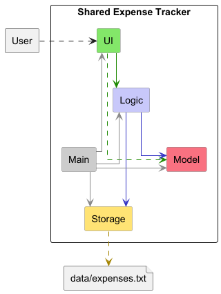
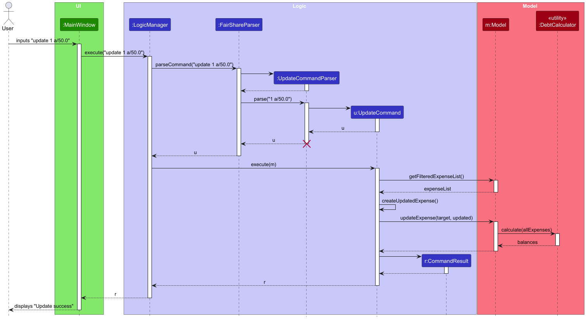
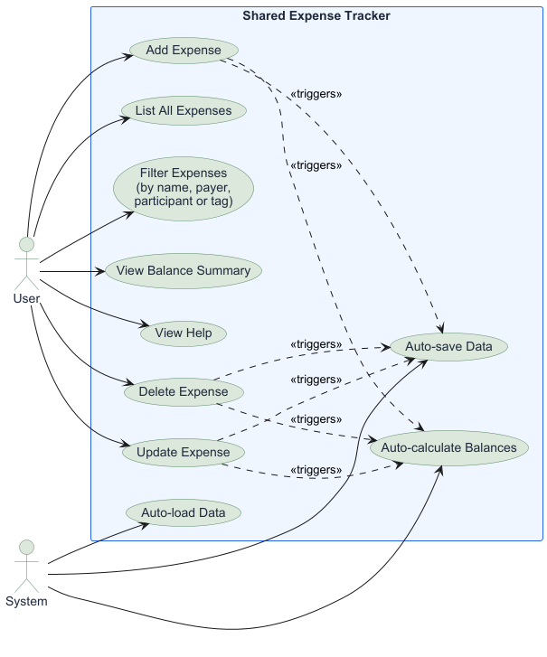

# Software Design Documentation (SDD)

## Table of Contents
- [1. System Overview](#1-system-overview)
- [2. Architecture Design](#2-architecture-design)
  - [2.1 Architectural Pattern](#21-architectural-pattern)
- [3. Major System Components](#3-major-system-components)
  - [3.1 Model Layer](#31-model-layer)
  - [3.2 Logic Layer](#32-logic-layer)
  - [3.3 UI Layer](#33-ui-layer)
  - [3.4 Storage layer](#34-storage-layer)
- [4. UML Diagrams](#4-uml-diagrams)
  - [4.1 Class Diagrams](#41-class-diagrams)
  - [4.2 Sequence Diagrams](#42-sequence-diagrams-)
  - [4.3 Use Case Diagrams](#43-use-case-diagram)
- [5. Key Design Decisions](#5-key-design-decisions)
  - [5.1 Layered Architecture]( #51-layered-architecture)
  - [5.2 Command Pattern for Logic](#52-command-pattern-for-logic)
  - [5.3 Plain-text Storage](#53-plain-text-storage)
  - [5.4 JavaFX ObservableList for UI Binding](#54-javafx-observablelist-for-ui-binding)

## 1. System Overview
The Shared Expense Tracker is an application that enables groups of users to record, manage and settle shared expenses.
It targets friend groups, housemates and small teams who need to split costs without manual calculation.
**The system allows users to:**
- Record expenses with a payer, amount, description and list of involved
  participants using a command-line style input
- Support equal split and proportional split
    (e.g. s/bob:2 s/mary:1 means bob pays 2/3, mary pays 1/3)
- Update existing expenses without deleting and recreating them
- Automatically calculate how much each member owes using a debt
- Automatically calculate how much each member owes using a debt
  simplification algorithm
- View a simplified balance summary showing who owes whom and how much
- Filter expenses by name, payer, participant or tag
- Persist all expense data locally between sessions
- Access a help window listing all available commands

## 2. Architecture Design
### 2.1 Architectural Pattern

Each layer communicates only with adjacent layers. The UI layer never directly addresses storage and the storage layer has no knowledge of the UI. 
This separation makes the system easier to test and maintain. 

## 3. Major System Components
### 3.1 Model Layer
The model layer contains pure data classes with no business logic or UI
dependencies. Key classes:
- `Expense` — stores expense name, amount, payer, participants and tags
- `Person` — stores a person's name
- `Tag` — stores a tag name
- `Balance` — represents a directional debt between two persons
- `BalanceCalculator` - calculates net balance of each user
- `ExpenseList` — wraps an `ObservableList<Expense>` for JavaFX binding
- `ModelManager` — implements `Model`, manages `ExpenseList` and
  `FilteredList`
- `Participant` - stores a person and their number of shares for proportional split expenses. Each expense has a list of participants with share values that determine how the cost is divided.

### 3.2 Logic Layer
The logic layer processes all user commands. It follows the Command
Pattern — each command is parsed into a `Command` object and executed
against the `Model`.
- `LogicManager` — implements `Logic`, coordinates parsing and execution
- `FairShareParser` — parses the command word and delegates to the
  appropriate parser
- `AddCommandParser`, `DeleteCommandParser`, `FilterCommandParser` —
  parse arguments for each command
- `AddCommand`, `DeleteCommand`, `FilterCommand`, `ListCommand` —
  execute operations against the model
- `CommandResult` — wraps the feedback string returned after execution
- `ParserUtil` — utility class providing shared parsing methods such
  as tokenizing command arguments, extracting field values and
  validating input formats
- `UpdateCommand` — updates specific fields of an existing expense by index. Uses an `UpdateFields` inner class to hold only the fields that need changing.
- `UpdateCommandParser` — parses the update command arguments

### 3.3 UI Layer
Built with JavaFX and FXML. Each component loads its own `.fxml` file
using `FXMLLoader`.
- `MainWindow` — root window, implements `Ui`, holds all sub-panels
- `ExpenseListPanel` — displays the filtered expense list as cards
- `ExpenseCard` — renders a single expense's details
- `BalancePanel` — displays the simplified debt summary as cards
- `BalanceCard` — renders a single balance entry
- `ResultDisplay` — shows command feedback messages
- `CommandBox` — accepts user text input, executes on Enter or button
- `HelpWindow` — separate popup window listing all available commands

### 3.4 Storage Layer
Handles reading and writing all expense data to a local plain-text file.
- `StorageManager` — implements `Storage`, delegates to `TxtFairShareStorage`
- `TxtFairShareStorage` — reads and writes to `data/expenses.txt`. Handles corrupted files by deleting them and throwing a `StorageException` so the app can start fresh with a warning.
- `TxtSerializableFairShare` — converts between `Expense` objects and text lines
- `TxtAdaptedParticipant` — storage representation of a `Participant`, serialized as `name:shares` e.g. `bob:2`

## 4. UML Diagrams
### 4.1 Class Diagrams
The system is organized into four layers. Each layer's class diagram
is shown below.

**UI Layer:**

**Logic Layer:**

**Model Layer:**

**Storage Layer:**

### 4.2 Sequence Diagrams 
**Add Expense:**

The sequence diagram above illustrates the flow when a user types
`add n/Lunch a/20.0 p/alice s/alice s/bob t/food`:
1. User types the command into `MainWindow`
2. `MainWindow` calls `execute()` on `LogicManager`
3. `LogicManager` passes the input to `FairShareParser`
4. `FairShareParser` creates `AddCommandParser` which parses the
   arguments and creates `AddCommand`
5. `LogicManager` calls `execute(model)` on `AddCommand`
6. `AddCommand` calls `addExpense()` on `Model`
7. `Model` calls `DebtCalculator.calculate()` to recompute balances
8. `LogicManager` calls `saveExpenseTracker()` on `Storage`
9. `MainWindow` refreshes all UI panels

**Delete Expense:**

The sequence diagram above illustrates the flow when a user types
`delete 1`:
1. User types the command into `MainWindow`
2. `MainWindow` calls `execute()` on `LogicManager`
3. `LogicManager` passes the input to `FairShareParser`
4. `FairShareParser` creates `DeleteCommandParser` which parses the
   index argument and creates `DeleteCommand`
5. `LogicManager` calls `execute(model)` on `DeleteCommand`
6. `DeleteCommand` calls `deleteExpense(targetIndex)` on `Model`
7. `Model` calls `DebtCalculator.calculate()` to recompute balances
   with the remaining expenses
8. `LogicManager` calls `saveExpenseTracker()` on `Storage` to
   persist the updated state
9. `MainWindow` refreshes all UI panels and displays
   "expense deleted"

**Update Expense:**

The flow when a user types `update 1 a/50.0`:
1. User types the command into `MainWindow`
2. `MainWindow` calls `execute()` on `LogicManager`
3. `LogicManager` passes the input to `FairShareParser`
4. `FairShareParser` creates `UpdateCommandParser` which parses the
   index and fields, creating an `UpdateCommand` with an
   `UpdateFields` object containing only the changed fields
5. `LogicManager` calls `execute(model)` on `UpdateCommand`
6. `UpdateCommand` gets the target expense from the filtered list,
   creates a new `Expense` with the updated fields, and calls
   `model.updateExpense()`
7. `Model` recalculates balances via `DebtCalculator`
8. `LogicManager` saves updated state via `Storage`
9. `MainWindow` refreshes all UI panels

### 4.3 Use Case Diagram

The use case diagram above shows all interactions between actors and
the system in the current implementation.

**User** can:
- Add an expense specifying name, amount, payer, participants and tags
- Delete an expense by index
- List all expenses
- Filter expenses by name, payer, participant or tag
- View the balance summary showing who owes whom
- Open the help window to view all available commands

**System** automatically:
- Recalculates balances after every add or delete
- Saves data to disk after every command
- Loads saved data on application startup 

## 5. Key Design Decisions

### 5.1 Layered Architecture
**Decision:** Adopt a strict layered architecture (UI → Logic → Model →
Storage) with no cross-layer dependencies.
**Rationale:** Separating concerns allows team members to work on
different layers in parallel without conflicts and makes each layer
independently testable.

### 5.2 Command Pattern for Logic
**Decision:** Each user action is encapsulated as a `Command` object
parsed by a dedicated parser class.
**Rationale:** Adding new commands only requires creating a new
`Command` and `Parser` class without modifying existing code, following
the Open-Closed principle.

### 5.3 Plain-Text Storage
**Decision:** Persist data as a pipe-delimited `.txt` file using custom
serialization.
**Rationale:** Simple to implement and debug without external
dependencies. Each expense is stored as one line in the format
`name|amount|payer|shares|tags`.

### 5.4 JavaFX ObservableList for UI Binding
**Decision:** Use `ObservableList` and `FilteredList` from JavaFX for
the expense list.
**Rationale:** JavaFX `ListView` automatically reflects changes to an
`ObservableList`, reducing the need for manual UI refresh calls.

### 5.5 Proportional Split Using Participant Shares
**Decision:** Model split proportions as integer shares per participant
rather than percentages or fixed amounts.
**Rationale:** Integer shares are simpler to input and reason about.
`s/bob:2 s/mary:1` is more intuitive than `s/bob:66.67 s/mary:33.33`.
The fraction is computed at display time from the participant's shares
divided by the total shares.

### 5.6 Graceful Handling of Corrupted Storage Files
**Decision:** When the storage file cannot be parsed, delete it and
start with an empty expense list rather than crashing.
**Rationale:** A corrupted file should not prevent the app from
launching. The user is shown a warning message on startup so they are
aware their previous data was lost.
