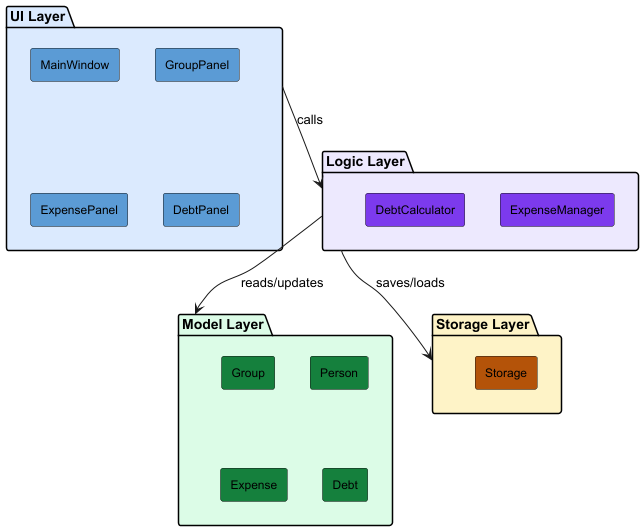
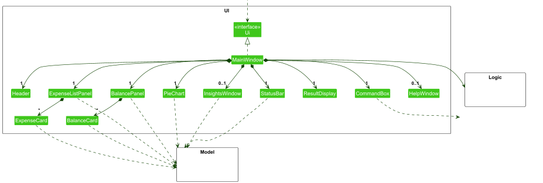
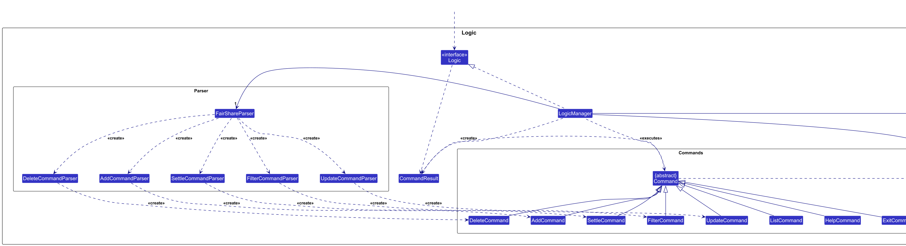
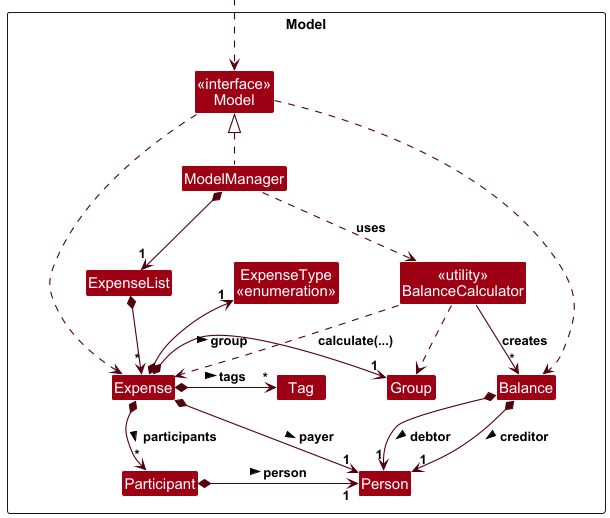
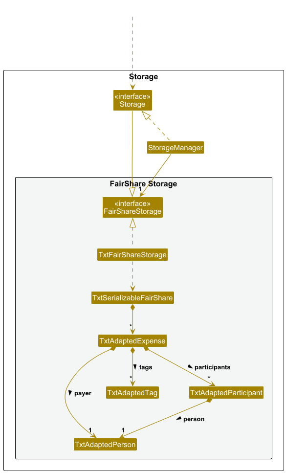
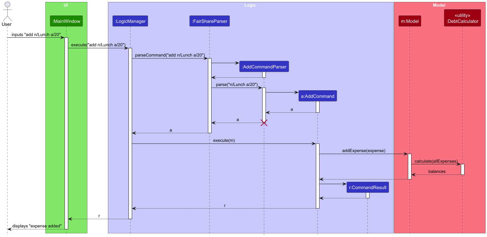
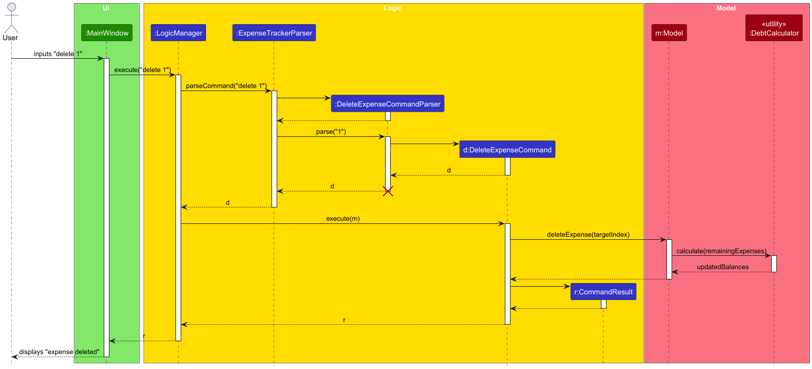
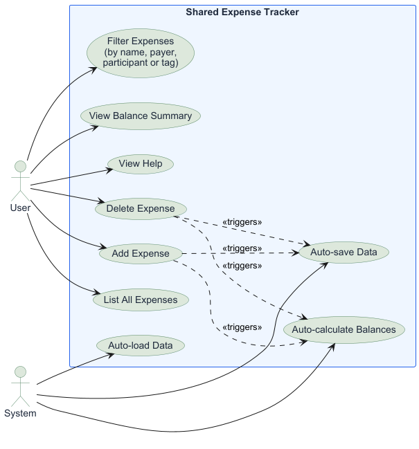

# Software Design Documentation (SDD)

## Table of Contents
- [1. System Overview](#1-system-overview)
- [2. Architecture Design](#2-architecture-design)
  - [2.1 Architectural Pattern](#architectural-pattern)
- [3. Major System Components](#3-major-system-components)
  - [Model Layer](#model-layer)
  - [Logic Layer](#logic-layer)
  - [UI Layer](#ui-layer)
  - [Storage layer](#storage-layer)
- [4. UML Diagrams](#4-uml-diagrams)
  - [4.1 Class Diagrams](#class-diagrams)
  - [4.2 Sequence Diagrams](#sequence-diagrams-)
  - [4.3 Use Case Diagrams](#use-case-diagram)
- [5. Key Design Decisions](#5-key-design-decisions)
  - [5.1 Layered Architecture]( #layered-architecture)

## 1. System Overview
The Shared Expense Tracker is an application that enables groups of users to record, manage and settle shared expenses.
It targets friend groups, housemates and small teams who need to split costs without manual calculation.
**The system allows users to:**
- Record expenses with a payer, amount, description and list of involved
  participants using a command-line style input
- Automatically calculate how much each member owes using a debt
  simplification algorithm
- View a simplified balance summary showing who owes whom and how much
- Filter expenses by name, payer, participant or tag
- Persist all expense data locally between sessions
- Access a help window listing all available commands

## 2. Architecture Design
### Architectural Pattern

Each layer communicates only with adjacent layers. The UI layer never directly addresses storage and the storage layer has no knowledge of the UI. 
This separation makes the system easier to test and maintain. 

## 3. Major System Components
### Model Layer
The model layer contains pure data classes with no business logic or UI
dependencies. Key classes:
- `Expense` — stores expense name, amount, payer, participants and tags
- `Person` — stores a person's name
- `Tag` — stores a tag name
- `Balance` — represents a directional debt between two persons
- `ExpenseList` — wraps an `ObservableList<Expense>` for JavaFX binding
- `ModelManager` — implements `Model`, manages `ExpenseList` and
  `FilteredList`

### Logic Layer
The logic layer processes all user commands. It follows the Command
Pattern — each command is parsed into a `Command` object and executed
against the `Model`.
- `LogicManager` — implements `Logic`, coordinates parsing and execution
- `FairShareParser` — parses the command word and delegates to the
  appropriate parser
- `AddCommandParser`, `DeleteCommandParser`, `FilterCommandParser` —
  parse arguments for each command
- `AddCommand`, `DeleteCommand`, `FilterCommand`, `ListCommand` —
  execute operations against the model
- `CommandResult` — wraps the feedback string returned after execution

### UI Layer
Built with JavaFX and FXML. Each component loads its own `.fxml` file
using `FXMLLoader`.
- `MainWindow` — root window, implements `Ui`, holds all sub-panels
- `ExpenseListPanel` — displays the filtered expense list as cards
- `ExpenseCard` — renders a single expense's details
- `BalancePanel` — displays the simplified debt summary as cards
- `BalanceCard` — renders a single balance entry
- `ResultDisplay` — shows command feedback messages
- `CommandBox` — accepts user text input, executes on Enter or button
- `HelpWindow` — separate popup window listing all available commands

### Storage Layer
Handles reading and writing all expense data to a local plain-text file.
- `StorageManager` — implements `Storage`, delegates to
  `TxtExpenseTrackerStorage`
- `TxtExpenseTrackerStorage` — reads and writes to `data/expenses.txt`
- `TxtSerializableExpenseTracker` — converts between `Expense` objects
  and text lines
- `TxtAdaptedExpense`, `TxtAdaptedPerson`, `TxtAdaptedTag` — storage
  representations of model objects

## 4. UML Diagrams
### Class Diagrams
The system is organized into four layers. Each layer's class diagram
is shown below.

**UI Layer:**

**Logic Layer:**

**Model Layer:**

**Storage Layer:**

### Sequence Diagrams 
**Add Expense:**

The sequence diagram above illustrates the flow when a user types
`add n/Lunch a/20.0 p/alice s/alice s/bob t/food`:
1. User types the command into `MainWindow`
2. `MainWindow` calls `execute()` on `LogicManager`
3. `LogicManager` passes the input to `FairShareParser`
4. `FairShareParser` creates `AddCommandParser` which parses the
   arguments and creates `AddCommand`
5. `LogicManager` calls `execute(model)` on `AddCommand`
6. `AddCommand` calls `addExpense()` on `Model`
7. `Model` calls `DebtCalculator.calculate()` to recompute balances
8. `LogicManager` calls `saveExpenseTracker()` on `Storage`
9. `MainWindow` refreshes all UI panels

**Delete Expense:**

### Use Case Diagram

The use case diagram above illustrates the set of sequence of actions that both the user and system perform in the Shared Expense Tracker. 

## 5. Key Design Decisions

### 5.1 Layered Architecture
**Decision:** Adopt a strict layered architecture (UI → Logic → Model →
Storage) with no cross-layer dependencies.
**Rationale:** Separating concerns allows team members to work on
different layers in parallel without conflicts and makes each layer
independently testable.

### 5.2 Command Pattern for Logic
**Decision:** Each user action is encapsulated as a `Command` object
parsed by a dedicated parser class.
**Rationale:** Adding new commands only requires creating a new
`Command` and `Parser` class without modifying existing code, following
the Open-Closed principle.

### 5.3 Plain-Text Storage
**Decision:** Persist data as a pipe-delimited `.txt` file using custom
serialisation.
**Rationale:** Simple to implement and debug without external
dependencies. Each expense is stored as one line in the format
`name|amount|payer|shares|tags`.

### 5.4 JavaFX ObservableList for UI Binding
**Decision:** Use `ObservableList` and `FilteredList` from JavaFX for
the expense list.
**Rationale:** JavaFX `ListView` automatically reflects changes to an
`ObservableList`, reducing the need for manual UI refresh calls.
