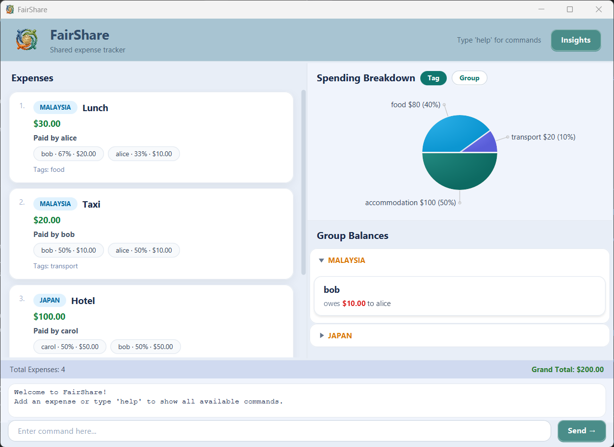

# FairShare User Guide

FairShare is a shared expense tracker that helps groups manage and split costs fairly. 
Whether you are on a trip with friends, sharing household bills with housemates, or splitting work lunches with colleagues, FairShare keeps track of who owes whom and how much.

---

## Table of Contents
- [Quick Start](#quick-start)
- [Features](#features)
  - [Managing Expenses](#1-managing-expenses)
    - [Adding an expense (equal split)](#adding-an-expense-equal-split-add)
    - [Adding an expense (proportional split)](#adding-an-expense-proportional-split-add)
    - [Deleting an expense](#deleting-an-expense-delete)
    - [Updating an expense](#updating-an-expense-update)
    - [Listing all expenses](#listing-all-expenses-list)
  - [Settling Debts](#2-settling-debts)
  - [Viewing Balances](#3-viewing-balances)
- [Other Features](#other-features)
  - [Viewing help window](#viewing-help-window-help)
  - [Exiting the app](#exiting-the-app-exit)
- [UI Features](#ui-features)
  - [Pie Chart](#1-pie-chart-)
  - [Insights Window](#2-insights-window)
  - [Status Bar](#3-status-bar)
- [Data Storage](#data-storage)
- [Frequently Asked Questions (FAQ)](#faq)
- [Known Issues](#known-issues)
- [Command Summary](#command-summary)

---

## Quick Start

1. Ensure you have **Java 21** or above installed on your computer.

2. Download the latest `fairshare.jar` file from [releases page](https://github.com/nus-cs2103de-ay2526s2-grp6/tp/releases).

3. Copy the file to a folder you want to use as the home folder for FairShare.

4. Open a command terminal, navigate to that folder, and run:
```
   java -jar fairshare.jar
```

5. A GUI similar to the below should appear:

   

6. Type commands in the input box and press **Send** (or press Enter) to execute them.

7. Try these example commands:
    - `help` : Shows all available commands
    - `add n/lunch a/30.0 g/malaysia p/alice s/alice s/bob s/carol t/food` : Adds an expense entry
    - `list` : Lists all recorded expenses
    - `filter g/malaysia` : Filters expenses named under the group `Malaysia`
    - `exit` : Exits the app

---

## Features
> **Notes about command format:**
> - Words in `UPPER_CASE` are parameters you supply.
> - Items in `[square brackets]` are optional.
> - Parameters with `...` can be repeated e.g. `s/PERSON...` --> means you can add multiple participants.
> - Group names are **case-insensitive** --> `Malaysia` and `malaysia` refer to the same group.

---

## 1. Managing Expenses

### Adding an expense (equal split): `add`
Adds a new shared expense where the cost is split equally
among all participants.

**Format: `add n/NAME a/AMOUNT g/GROUP p/PAYER s/PERSON... [t/TAG...]`**

- `n/NAME` — description of the expense
- `a/AMOUNT` — total amount paid
- `g/GROUP` — group this expense belongs to (created
  automatically if it does not exist)
- `p/PAYER` — person who paid
- `s/PERSON...` — one or more participants sharing the cost
- `t/TAG...` — optional tags for categorization

**Examples:**

`add n/Lunch a/30.0 g/malaysia p/alice s/alice s/bob s/carol t/food`

`add n/Taxi a/20.0 g/malaysia p/bob s/alice s/bob t/transport`

`add n/Hotel a/150.0 g/japan p/carol s/alice s/bob s/carol t/accommodation`

---

### Adding an expense (proportional split): `add`
Adds a shared expense where each participant pays a different proportion of the total cost.

**Format: `add n/NAME a/AMOUNT g/GROUP p/PAYER s/PERSON:SHARES... [t/TAG...]`**

- `s/PERSON:SHARES` — participant with their share value. The cost is divided proportionally based on share values.
    For example, `s/alice:2 s/bob:1` means alice pays 2/3 and bob pays 1/3 of the total.

**Examples:**

`add n/Lunch a/30.0 g/malaysia p/alice s/alice:2 s/bob:1 t/food` --> alice pays $20.00 (2/3), bob pays $10.00 (1/3)

`add n/Hotel a/150.0 g/japan p/carol s/alice:1 s/bob:2 s/carol:3 t/accommodation` --> alice pays $25.00, bob pays $50.00, carol pays $75.00

---

### Deleting an expense: `delete`
Removes an existing expense from the list by its index number. 

**Format:**
`delete INDEX`

- `INDEX` — the number shown beside the expense in the list.

**Examples:**

`delete 1`

`delete 3`

> ⚠️ **Warning:** Deleted expenses cannot be recovered.
> The balance panel will update automatically after deletion.

---

### Updating an expense: `update`
Edits the details of an existing expense. At least one field must be provided.

**Format:**
`update INDEX [n/NAME] [a/AMOUNT] [g/GROUP] [p/PAYER] [s/PERSON:SHARES...] [t/TAG...]`

**Examples:**

`update 1 a/50.0` --> updates amount of expense 1 to $50.00

`update 2 p/bob t/transport` --> updates payer and tag of expense 2

`update 3 s/alice:2 s/bob:1 s/carol:1` --> updates participant shares of expense 3

---

### Listing all expenses: `list`
Shows all recorded expenses and clears any active filter.

**Format:**
`list`

---

### Filtering expenses: 
Shows only expenses matching the given criteria. Multiple filters can be combined in one command.

**Format:**
`filter [g/GROUP] [n/NAME] [p/PAYER] [s/PERSON] [t/TAG]`

**Examples:**

`filter g/malaysia` --> shows only malaysia group expenses

`filter p/alice` --> shows only expenses paid by alice

`filter t/food` --> shows only expenses tagged as food

`filter g/malaysia t/food` --> shows malaysia expenses tagged as food

> 💡 **Tip:** Run `list` to clear the filter and show all expenses again.

---

## 2. Settling Debts

### Recording a settlement: `settle`
Records a debt repayment between two members in a group. This updates the balance panel to reflect the payment.

**Format:**
`settle g/GROUP p/PAYER r/RECEIVER a/AMOUNT`

**Examples:**

`settle g/malaysia p/bob r/alice a/10.00` -->  bob pays alice $10.00 in the malaysia group

`settle g/japan p/alice r/carol a/25.00` --> alice pays carol $25.00 in the japan group

> 💡 **Tip:** Settlements appear in the expense list with a green badge and are excluded from the pie chart and status bar totals.

---

## 3. Viewing Balances
The **Balance Panel** on the right side of the app shows who owes whom, grouped by group name.

- Click a group name to expand or collapse its balance cards.
- Groups with outstanding debts show an **orange** indicator.
- Groups where all debts are settled show a **green** indicator.
- When all debts are cleared, the panel shows
  **"No outstanding balances."**

---

## Other Features

### Viewing help window: `help`
Opens a popup window listing all available commands with their formats and examples.

---

### Exiting the app: `exit`
Closes FairShare. All data is saved automatically before the app closes.

---

## UI Features

### 1. Pie Chart 
The pie chart on the upper right shows a spending breakdown. It updates automatically after every command.

- Click **Tag** to view spending broken down by expense tag.
- Click **Group** to view spending broken down by group name.
- Settlements are excluded from the chart.
- When there are no expenses, a **"No expenses yet"** message is shown instead of an empty chart.

---

### 2. Insights Window
Click the **Insights** button in the header to open the Insights window. It shows statistics for each group:
- **Active Groups** --> groups with outstanding balances shown with an orange badge
- **Settled Groups** --> groups where all debts are cleared shown with a green badge

Each group card shows:
- Number of expenses, members and total amount spent
- **Biggest expense** —> the most expensive item in the group
- **Top spender** —> the person who paid the most
- **Top tag** —> the most used tag in the group

> 💡 **Tip:** The Insights window updates automatically whenever you add, delete or update an expense; even while it is open.

---

### 3. Status Bar
The status bar at the bottom of the expense list shows a quick summary:
- **Left** —> total number of expenses (excluding settlements)
- **Right** —> total amount spent (excluding settlements)

---

## Data Storage
All expense data is saved automatically to `data/expenses.txt`after every command. No manual saving is required.
When you relaunch FairShare, your data is loaded automatically.

> ⚠️ **Warning:** Do not edit `data/expenses.txt` manually.
> Incorrect formatting will cause the file to be deleted and your data will be lost. FairShare will show a warning message and start fresh if the file is corrupted.

**To transfer data to another computer:**
Copy the `data` folder from your FairShare home folder to the same location on the new computer.

---

## FAQ
**Q: How do I create a new group?**

A: Groups are created automatically when you add an expense with a new group name using `g/GROUPNAME`. 
There is no separate command to create a group.

**Q: Are group names case-sensitive?**

A: No. `Malaysia`, `malaysia` and `MALAYSIA` all refer to the same group. Group names are stored in lowercase.

**Q: Can I add an expense without tags?**

A: Yes. The `t/TAG` parameter is optional. Expenses without
tags will show `Tags: -` on the card and appear as `Untagged` in the pie chart.

**Q: What happens if I accidentally delete an expense?**

A: Deleted expenses cannot be recovered. Be careful before running `delete`.

**Q: Can I split an expense among different groups?**

A: No. Each expense belongs to exactly one group specified by `g/GROUP`.

**Q: What does the filter command do to the balance panel?**

A: The balance panel always shows balances for all groups regardless of the current filter. 
Only the expense list and pie chart are affected by filters.

**Q: How do I know if all debts in a group are settled?**

A: The balance panel shows a green **"✓ All settled up"** message inside the group pane. 
The Insights window also moves the group from Active Groups to Settled Groups.

---

## Known Issues
- Very long expense names may overflow the card width
- Emoji icons in the Insights window may not render correctly on all operating systems
- The window title shows `FairShare` without an expense count when the app first launches

---

## Command Summary

| Action | Format | Example |
|---|---|---|
| Add expense (equal) | `add n/NAME a/AMOUNT g/GROUP p/PAYER s/PERSON... [t/TAG...]` | `add n/Lunch a/30.0 g/malaysia p/alice s/alice s/bob t/food` |
| Add expense (proportional) | `add n/NAME a/AMOUNT g/GROUP p/PAYER s/PERSON:SHARES... [t/TAG...]` | `add n/Lunch a/30.0 g/malaysia p/alice s/alice:2 s/bob:1 t/food` |
| Delete expense | `delete INDEX` | `delete 1` |
| Update expense | `update INDEX [fields...]` | `update 1 a/50.0 p/bob` |
| List all expenses | `list` | `list` |
| Filter expenses | `filter [g/GROUP] [n/NAME] [p/PAYER] [s/PERSON] [t/TAG]` | `filter g/malaysia` |
| Settle debt | `settle g/GROUP p/PAYER r/RECEIVER a/AMOUNT` | `settle g/malaysia p/bob r/alice a/10.00` |
| Help | `help` | `help` |
| Exit | `exit` | `exit` |
